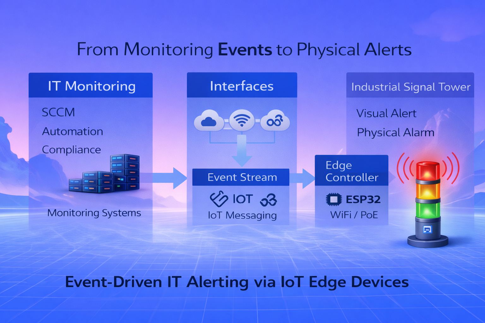

# ESP32 Industrial Signal Tower Controller

A modular ESP32-based controller for industrial LED signal towers designed
to visualize monitoring system states in physical environments.

The project explores how embedded systems can be used to provide clear visual
status indicators for infrastructure monitoring platforms such as datacenter
monitoring, industrial automation environments, or control rooms.

---

# Overview

Modern infrastructure environments rely heavily on monitoring systems to detect
failures and abnormal operating conditions.

Typical alerts are delivered through dashboards, notifications, or log systems.
However, in many operational scenarios a **clear visual signal in the physical
environment** can significantly improve response time.

Industrial signal towers provide a simple and robust way to visualize system
states locally.

This project aims to build a modular controller that allows such signal towers
to be integrated with monitoring systems and automation platforms.

---

# Motivation

In large technical environments it is often difficult to quickly locate the
source of an infrastructure problem.

Examples include:

- server racks in datacenters
- network cabinets in wiring centers
- production equipment
- energy infrastructure
- operations control rooms

Enterprise storage systems already use similar concepts.  
For example, **fault LEDs on storage arrays help technicians identify the
exact location of a failed hard drive**.

This project applies the same idea on a larger scale by using industrial signal
towers to visualize monitoring states.

The goal is to improve **fault localization and operational awareness** in
technical environments.

---

# Documentation

Detailed design documentation is available in the `docs` directory.

- [System Architecture](docs/system_architecture.md)
- [Use Cases](docs/use_cases.md)
- [Hardware Architecture](docs/hardware_architecture.md)
- [Power Architecture](docs/power_architecture.md)
- [Network and Reliability](docs/network_and_reliability.md)

---

## Project Status

The project has progressed beyond the initial concept phase.

Current status:

- hardware architecture defined
- perfboard prototype Rev.B assembled
- transistor output stage validated
- ESPHome firmware running
- W5500 Ethernet connectivity verified
- DHCP networking operational

Documentation and firmware examples are included to allow
reproduction of the prototype.

## Firmware Behavior

The runtime behavior of the signal tower firmware is documented here:

[Software Behavior](docs/software_behavior.md)

---

# License

MIT License