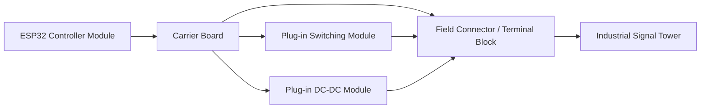

# Hardware Architecture

This document describes the hardware architecture of the industrial
signal tower controller.

The design follows a **modular hardware concept** that prioritizes
maintainability, flexibility, and rapid replacement of individual
components.

Instead of building a highly integrated custom PCB from the beginning,
the system is intentionally structured as a set of interchangeable
modules.

This approach simplifies prototyping, reduces development risk, and
allows hardware components to be replaced easily in operational
environments.

---

# Design Principles

The hardware architecture separates the system into several functional
layers.

The main design principles are:

* modular hardware architecture
* use of widely available components
* minimal custom power electronics
* easy replacement of defective modules
* suitability for prototypes and small-scale deployments

Instead of integrating all functions into a single PCB, the following
functional blocks are separated:

* control logic
* output switching stage
* voltage conversion stage
* field wiring / signal tower connection

---

# Hardware Block Diagram

The carrier board acts as the central interconnection platform for the
modular components.

Individual modules can be replaced or upgraded without redesigning the
entire controller hardware.

---

# Controller Module

The controller module contains the ESP32 microcontroller responsible
for:

* communication with monitoring systems
* signal state processing
* output control
* network connectivity

Depending on the deployment scenario, the controller may use:

* Ethernet connectivity
* Power over Ethernet (PoE)
* Wi-Fi (primarily for development environments)

For infrastructure-oriented installations, **Ethernet connectivity is
preferred** due to higher reliability and operational stability.

---

# Switching Stage

The switching stage connects the low-voltage GPIO signals of the ESP32
to the signal tower modules.

Possible implementations include:

* MOSFET switching stages
* transistor driver modules
* relay modules (optional)

The switching stage activates the individual color modules of the
industrial signal tower.

---

# Power Conversion

Industrial signal towers typically operate on **12V or 24V supply
voltage**.

The controller itself, however, usually operates at **5V or 3.3V**.

To bridge this difference, the design uses a **modular DC-DC converter
stage**.

Possible configurations include:

* step-up converter (5V → 12V)
* local 12V supply
* PoE powered system with integrated step-up conversion

Using modular converter boards simplifies replacement and avoids the
complexity of designing custom high-current power electronics.

---

# Modular Hardware Strategy

The modular concept provides several operational advantages:

* simplified troubleshooting
* rapid replacement of defective modules
* reduced development complexity
* easier sourcing of replacement parts
* flexibility for different deployment scenarios

While a fully integrated PCB might be preferable for large-scale
manufacturing, the modular design is better suited for:

* experimental infrastructure projects
* prototyping
* small batch production
* field-serviceable installations

---

# Maintenance Perspective

Industrial signal towers are sometimes damaged or replaced during normal
operation, especially in production environments.

A modular control platform allows maintenance personnel to replace
individual hardware components quickly without replacing the entire
controller.

This reduces downtime and simplifies service procedures.

---

# Detailed Hardware Documentation

More detailed information about the LED signal tower controller hardware
can be found in the following documents.

## LED Tower Hardware Design

Complete description of the LED tower controller hardware design,
including power architecture and switching concept.

* [LED Tower Hardware Design](../hardware/led_tower_design.md)

## Electrical Measurements

Measured current consumption and electrical characteristics of the LED
tower modules used in the prototype.

* [LED Tower Electrical Measurements](../hardware/led_tower_measurements.md)

## Schematic Description

Detailed explanation of the switching stage, GPIO mapping, and connector
layout.

* [LED Tower Schematic Description](../hardware/led_tower_schematic.md)

## System Block Diagram

High-level system architecture showing the relationship between power
supply, controller, and LED tower modules.

* [LED Tower Block Diagram](../hardware/led_tower_blockdiagram.md)

---

# Related Documentation

Additional system aspects are described in the following documents:

* System Architecture
* Power Architecture
* Network and Reliability Considerations
