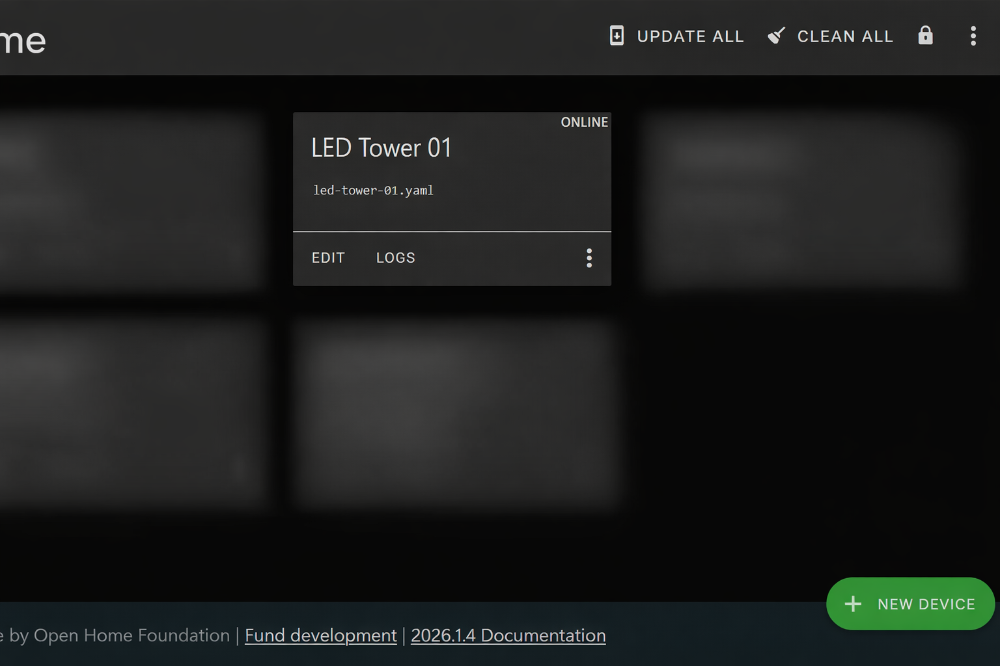
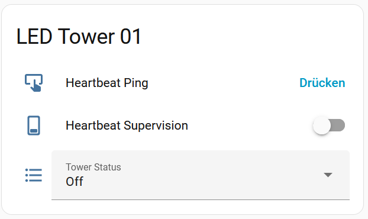
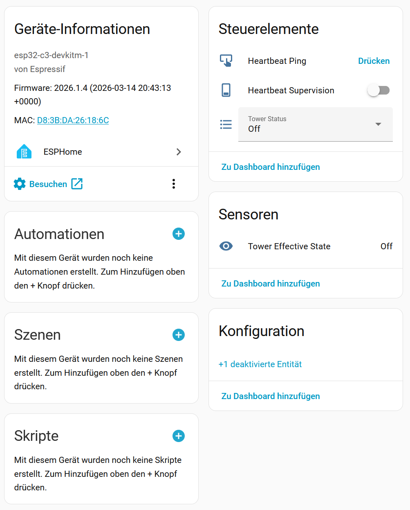

[⬅ Back to Documentation Overview](README.md)

---

# Software Behavior

This document describes the runtime behavior of the signal tower
controller firmware.

The firmware is implemented using **ESPHome** and exposes a simple
control interface to **Home Assistant**.

The signal tower represents system states using a defined LED signaling
model.

---

# Signal States

The tower supports several predefined states that correspond to typical
monitoring conditions.

| State | LED Behavior |
|------|--------------|
| Off | All LEDs off |
| Normal | Green LED on |
| Warning | Yellow LED on |
| Warning Blink | Yellow LED blinking |
| Alarm | Red LED on |
| Alarm Blink Slow | Red LED blinking (1 Hz) |
| Alarm Blink Fast | Red LED blinking (2 Hz) |

Only **one state can be active at a time**.

The state is selected via the **Home Assistant entity** `Tower Status`.

---

# State Priority

The firmware ensures that only one visual state is active.

State selection logic:

1. Heartbeat failure state (highest priority)
2. Selected tower state
3. Off state (default)

---

# Heartbeat Supervision

The controller supports optional **heartbeat supervision**.

This mechanism ensures that the signal tower does not continue to
display outdated status information when communication with the control
system fails.

Heartbeat supervision can be enabled or disabled via Home Assistant.

---

## Heartbeat Mechanism

Home Assistant periodically sends a **Heartbeat Ping** to the controller.

Each received ping updates the internal heartbeat timer.

If the controller does not receive a heartbeat within the configured
timeout period, a **heartbeat failure state** is activated.

---

# Heartbeat Failure Signal

When the heartbeat times out, the tower switches to a dedicated
communication failure signal.

Pattern:

All LEDs ON for 0.5 seconds
every 3 seconds

This indicates that the displayed monitoring state can no longer be
trusted.

---

# Heartbeat Recovery Behavior

When a heartbeat is received again:

- the heartbeat failure state is cleared
- the tower returns to **Off**

The previous tower state is **not automatically restored**.

This ensures that outdated information is not displayed.

The next monitoring update from Home Assistant will activate the
appropriate signal state again.

---

# Home Assistant Entities

The firmware exposes the following entities to Home Assistant.

## Tower Status (Select)

Main control entity.

Allows selection of the active signal state.

Options:

- Off
- Normal
- Warning
- Warning Blink
- Alarm
- Alarm Blink Slow
- Alarm Blink Fast

---

## Heartbeat Supervision (Switch)

Enables or disables heartbeat monitoring.

When disabled, the heartbeat timeout logic is inactive.

---

## Heartbeat Ping (Button)

Updates the heartbeat timer.

Typically triggered periodically by an automation in Home Assistant.

---

## Tower Effective State (Sensor)

Reports the currently active signal state.

Possible values:

- Off
- Normal
- Warning
- WarningBlink
- Alarm
- AlarmBlinkSlow
- AlarmBlinkFast
- HeartbeatLost

---

# Typical Home Assistant Setup

A common configuration uses:

- a **Select entity** to control the tower state
- an **automation** sending heartbeat pings
- a **dashboard card** for manual override

Example use cases include:

- infrastructure monitoring
- server health indication
- CI pipeline status display
- lab status indication

## ESPHome Device

Example device in the ESPHome dashboard.

## Home Assistant Control

The tower state can be controlled via Home Assistant.

## Heartbeat Supervision

The tower supports an optional heartbeat supervision.

Home Assistant periodically sends a heartbeat ping to the device.

If no heartbeat is received within the timeout period, the tower
switches to a communication failure signal.

Signal pattern:

All LEDs ON for 0.5 seconds every 3 seconds.

This indicates that the displayed status information may no longer
be valid.

When a heartbeat is received again the tower switches to **Off**.
The previous state is not restored automatically.