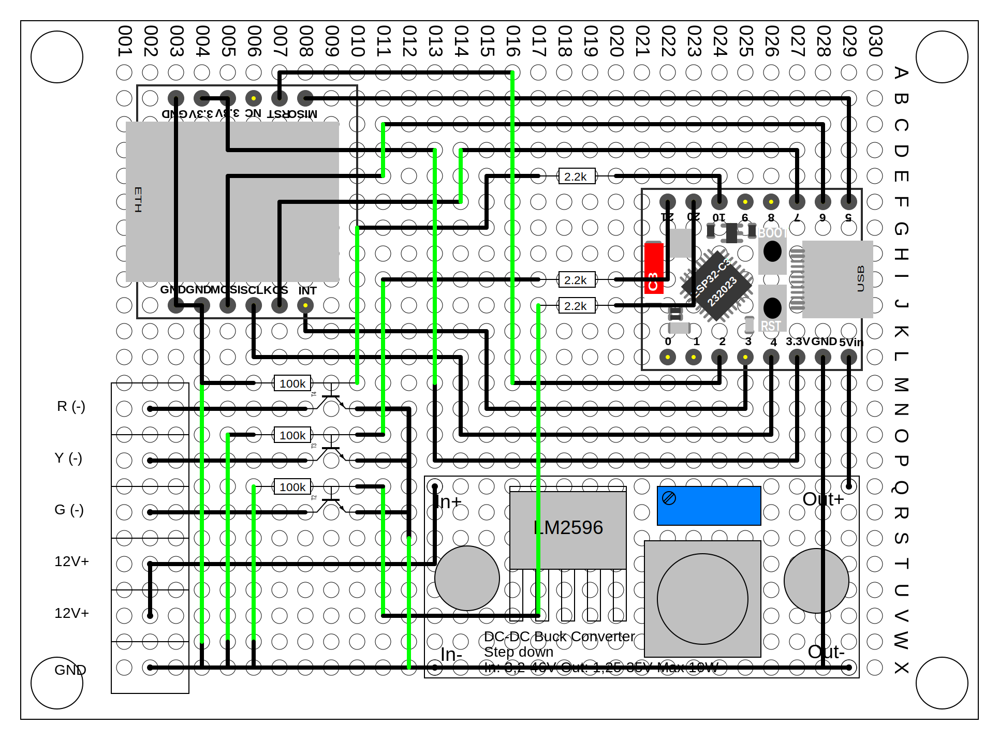

[⬅ Back to Hardware Overview](README.md)

# LED Tower Hardware – Prototype Rev.A

This document describes the first physical prototype of the LED tower controller.

The prototype is built on perfboard using plug-in modules.

## Modules

- ESP32-C3 SuperMini
- W5500 SPI Ethernet module
- LM2596 buck converter

## Layout

The layout was created using sPlan and implemented on perfboard.

## Design Goals

- validate hardware architecture
- test SPI Ethernet with W5500
- verify power architecture
- validate transistor output stage

## Pin Assignment

| Function | GPIO |
|--------|------|
| SPI SCK | GPIO4 |
| SPI MISO | GPIO5 |
| SPI MOSI | GPIO6 |
| W5500 CS | GPIO7 |
| W5500 INT | GPIO3 |
| W5500 RST | GPIO2 |
| LED RED | GPIO10 |
| LED YELLOW | GPIO20 |
| LED GREEN | GPIO21 |

## Power Architecture

12V input → LM2596 → 5V → ESP32 onboard regulator → 3.3V

The LED tower is powered directly from the 12V rail.

## Output Stage

Low-side switching using BC547C transistors.

Each channel uses:

- 2.2k base resistor
- 100k base pulldown