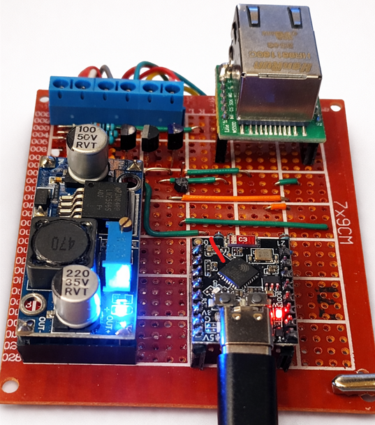
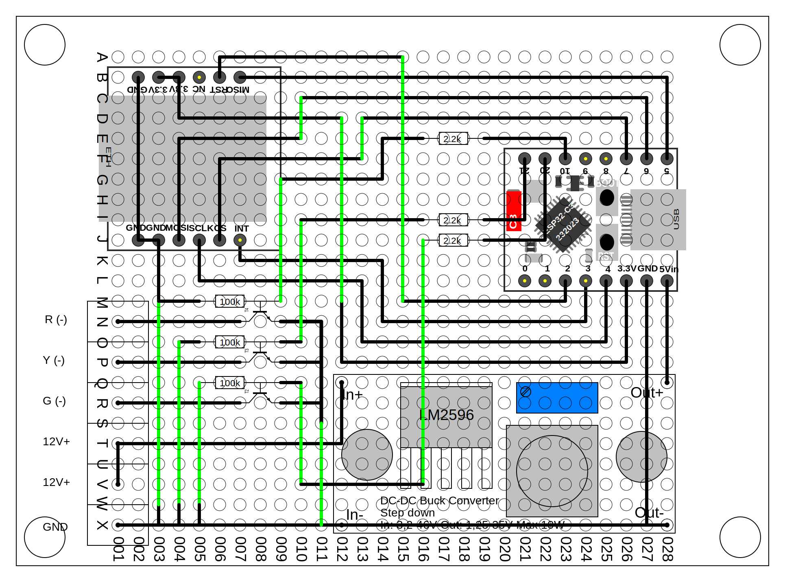

[⬅ Back to Hardware Overview](README.md)

# LED Signal Tower – Prototype Rev.B

  

## Overview

Prototype Rev.B is a minor mechanical revision of the initial prototype.

The original layout (Rev.A) assumed a **30-row perfboard**.  
During assembly it was discovered that the available prototype boards
only provided **28 rows**, requiring a slight rearrangement of the
component placement.

---

## Reason for Revision

The change was purely mechanical:

- prototype PCB had **28 rows instead of 30**
- components had to be repositioned slightly
- wiring layout was adjusted to fit the available board

---

## Electrical Design

The electrical design remains **identical to Rev.A**.

No changes were made to:

- transistor driver stage
- GPIO assignments
- power supply architecture
- LED tower connector
- component values

---

## Firmware Compatibility

Rev.B uses the same GPIO assignments as Rev.A and is therefore fully
compatible with the existing firmware and ESPHome test configurations.

No firmware changes were required.

---

## Prototype Layout

---

## Power Supply Used in Prototype

The prototype is currently powered by a simple external **12 V DC power
supply** connected to the input terminals.

While the system is designed to support **PoE powered deployments**, the
PoE hardware is not used in this prototype in order to keep the hardware
setup simple.

Functionally this is equivalent to using the 12 V output of a PoE
splitter.

---

# Hardware Validation

The following hardware subsystems have been validated using ESPHome
test firmware.

## Power Supply

- LM2596 step-down converter provides stable supply voltage
- ESP32-C3 boots reliably

## Output Stage

- transistor-based low-side switching verified
- LED tower segments respond correctly to GPIO signals

## Ethernet Connectivity

The W5500 SPI Ethernet module was successfully tested.

Results:

- SPI communication with W5500 operational
- DHCP address successfully obtained
- Ethernet link negotiated at **100 Mbit full duplex**
- ESPHome API accessible over wired network

Example log output:

Connected
IP Address: 192.168.1.100
Link Speed: 100
Is Full Duplex: YES

This confirms correct electrical integration of the Ethernet module
and SPI bus configuration.

---

## Summary

Rev.B represents a **mechanical adjustment** of the prototype layout
without electrical changes.

The revision ensures compatibility with commonly available
28-row perfboard prototypes while maintaining the original circuit design.