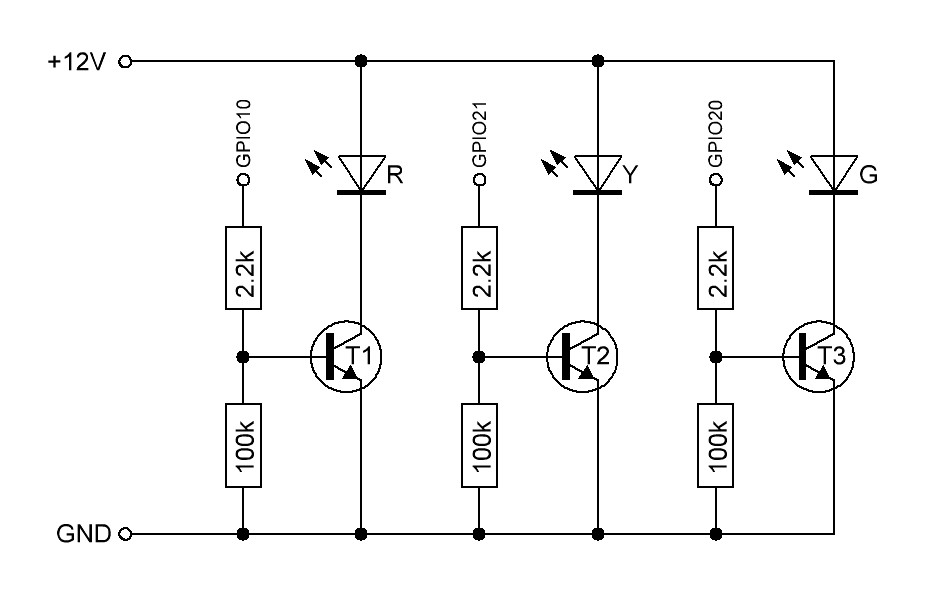

[⬅ Back to Hardware Architecture](../docs/hardware_architecture.md)

  ------------------
  
  # LED Signal
  Tower -- Schematic
  Description

  ## Overview

  This document
  describes the
  electrical
  schematic of the
  LED signal tower
  controller.

  The system uses a
  simple
  transistor-based
  output stage to
  switch individual
  LED segments
  connected to a
  common **+12 V
  supply rail**.

  The switching
  stage is
  controlled by an
  **ESP32-C3**
  microcontroller.
  
  ------------------

# Output Switching Topology

The LED tower is wired with a **common +12 V supply**.

Each LED segment is switched on the **low side** using an NPN
transistor.

------------------------------------------------------------------------

# LED Driver Stage

The practical implementation of the switching stage is shown below.

Each LED channel uses an **NPN transistor configured as a low-side
switch**.

The LED segment is connected to **+12 V**, while the transistor switches
the return path to **ground**.

------------------------------------------------------------------------

## Circuit Description

Each channel consists of:

-   NPN transistor (BC547C / 2SC720 / 2N3904)
-   base resistor **2.2 kΩ**
-   base pulldown resistor **100 kΩ**

The transistor emitter is connected to **GND**.

The collector connects to the **negative terminal of the LED segment**.

------------------------------------------------------------------------

## Base Current Calculation

ESP32 GPIO voltage:

    Vgpio = 3.3 V

Typical base-emitter voltage of a small signal NPN transistor:

    Vbe ≈ 0.7 V

Base resistor:

    Rbase = 2.2 kΩ

Resulting base current:

    Ib = (Vgpio − Vbe) / Rbase
    Ib = (3.3 V − 0.7 V) / 2200 Ω
    Ib ≈ 1.18 mA

------------------------------------------------------------------------

## LED Load Current

Measured LED currents of the prototype tower:

  Segment   Current
  --------- ---------
  Red       8.0 mA
  Yellow    4.6 mA
  Green     5.8 mA

Worst case collector current:

    Ic ≈ 8 mA

------------------------------------------------------------------------

## Saturation Condition

For reliable switching the transistor should operate in **saturation**.

A common conservative rule is:

    Ic / Ib ≤ 10

For this design:

    Ic / Ib = 8 mA / 1.18 mA ≈ 6.8

Result:

The transistor is **safely driven into saturation**, ensuring reliable
switching.

------------------------------------------------------------------------

## Base Pulldown Resistor

A **100 kΩ resistor** connects the transistor base to ground.

Purpose:

-   prevents floating GPIO states during ESP32 startup
-   ensures the transistor remains OFF while the GPIO is unconfigured
-   avoids unintended LED activation

Current through the pulldown resistor:

    I = 3.3 V / 100 kΩ ≈ 33 µA

This current is negligible and does not affect the base drive.

------------------------------------------------------------------------

# Output Channel Components

Each LED channel consists of three components.

  Component        Typical Value             Purpose
  ---------------- ------------------------- -------------------------
  NPN transistor   2SC720 / BC547 / 2N3904   Low-side switch
  Base resistor    2.2 kΩ                    Limits base current
  Base pulldown    100 kΩ                    Prevents floating input

------------------------------------------------------------------------

# Channel Assignment

The controller provides three independent LED outputs.

  Channel     Signal Name   Description
  ----------- ------------- ----------------------
  Channel 1   LED_RED       Red signal output
  Channel 2   LED_YELLOW    Yellow signal output
  Channel 3   LED_GREEN     Green signal output

------------------------------------------------------------------------

# GPIO Mapping (Example)

The exact GPIO assignment can be adjusted in firmware.

Example configuration:

  ESP32-C3 GPIO   Function
  --------------- ------------
  GPIO10          LED_RED
  GPIO21          LED_YELLOW
  GPIO20          LED_GREEN

Only standard GPIO pins should be used to avoid conflicts with boot or
flash functions.

------------------------------------------------------------------------

# Electrical Operation

## LED Off

When the GPIO output is **LOW**:

-   no base current flows
-   the transistor remains in cutoff
-   the LED segment is disconnected from ground
-   the LED remains off

------------------------------------------------------------------------

## LED On

When the GPIO output is **HIGH**:

-   base current flows through the base resistor
-   the transistor enters saturation
-   the LED segment is connected to ground
-   current flows through the LED

------------------------------------------------------------------------

# Current Analysis

Measured LED currents:

  Segment   Current
  --------- ---------
  Red       8.0 mA
  Yellow    4.6 mA
  Green     5.8 mA

With a base resistor of **2.2 kΩ**, the base current is approximately:

    Ib = (3.3 V − 0.7 V) / 2200 Ω
    Ib ≈ 1.18 mA

This provides ample drive current to saturate the transistor for the
measured collector currents.

------------------------------------------------------------------------

# LED Tower Connector

The LED tower is connected using a **4-pin connector**.

  Pin   Signal
  ----- ------------------------
  1     LED_COMMON_POS (+12 V)
  2     LED_RED_NEG
  3     LED_YELLOW_NEG
  4     LED_GREEN_NEG

------------------------------------------------------------------------

# Power Distribution

The system power architecture is intentionally simple.

    PoE
     │
     └── PoE Splitter / DC-DC
            │
            ├── 12 V rail → LED tower
            │
            └── Step-Down Converter → ESP32 supply

------------------------------------------------------------------------

# Recommended Power Filtering

For stable operation the following capacitors are recommended:

  Component              Value    Purpose
  ---------------------- -------- ------------------------------
  Bulk capacitor         100 µF   Stabilizes 12 V rail
  Decoupling capacitor   100 nF   Local ESP32 supply filtering

These components should be placed close to the respective supply inputs.

------------------------------------------------------------------------

# Design Margin

Due to the extremely low current consumption of the LED modules, the
transistor output stage operates far below its electrical limits.

This ensures:

-   high reliability
-   low thermal stress
-   large electrical safety margin
